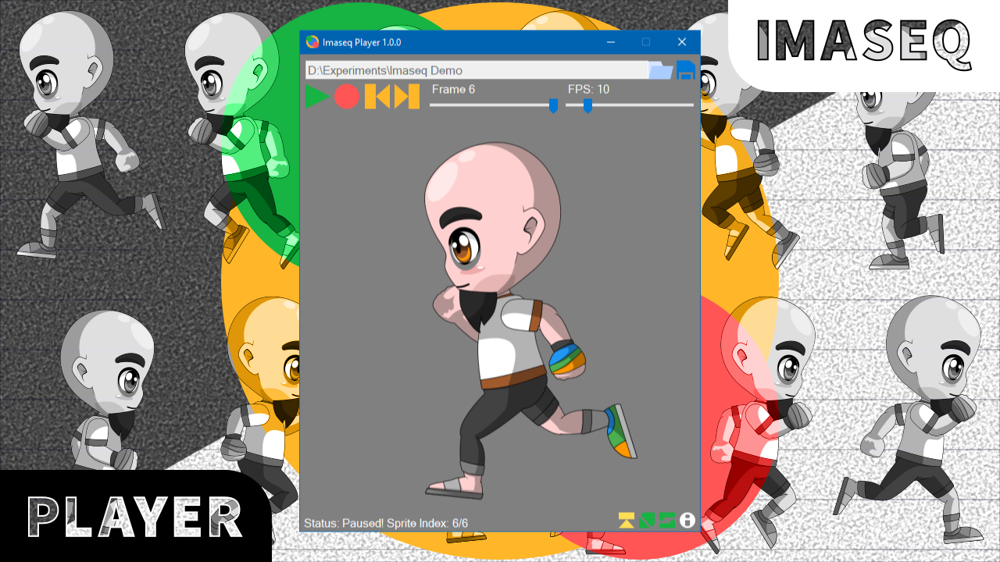
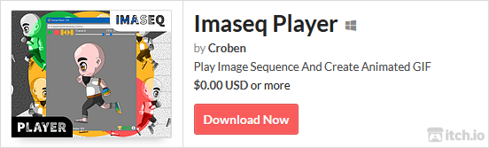

# WHAT IS IMASEQ PLAYER?

Imaseq Player is a free and open-source, image sequence player, and animated GIF maker for Windows 10, released under the MIT license. The developer (Croben) originally made Imaseq Player, to preview frame by frame animations made within Inkscape. Imaseq Player can play and create GIFs from images with PNG, JPG, and JPEG extensions.

# FEATURES

   - Play image sequence of PNG, JPG, and JPEG files.
   - Create an animated GIF from the image sequence.

# VIDEO

# HOW IT WORKS?

Imaseq Player works by looking for supported images through the user-provided directory. It will make sure there are at least two images, and they are all within the allowed dimensions. The program will then sort the images by its file name, and display them in sequence base on the speed slider’s value. And when the status of Imaseq Player is in playing or paused, the user will have the option to save the images as an animated GIF.

# LIMITATIONS

   - The window size is fixed.
   - Supported images are limited to PNG, JPG, and JPEG.
   - The minimum image dimension is 8×8 pixels.
   - The maximum image dimension is 1920×1080 pixels.
   - The maximum number of playable image is one thousand.
   - The maximum image display is 512 pixels.

# SYSTEM REQUIREMENTS

- Operating System: Windows 10
- .NET Framework: 4.0 and above

# HOW TO USE?

## Playing:
   - Place images in one folder.
   - Copy and paste the directory of the images, or locate it by clicking the folder icon.
   - Click play or press space on the keyboard.

## Creating GIF:
   - Once the status is in playing or paused, you can press the save icon. 
   - Select a location to save the GIF.
   - Name it.
   - Click Save.

# FRIENDLY TIPS

1. Avoid playing large images in high quantities.
2. On a lower-end computer, consider disabling “Edit While Playing.”
3. Name the images according to their order, for example, run1, run2, and so on.

